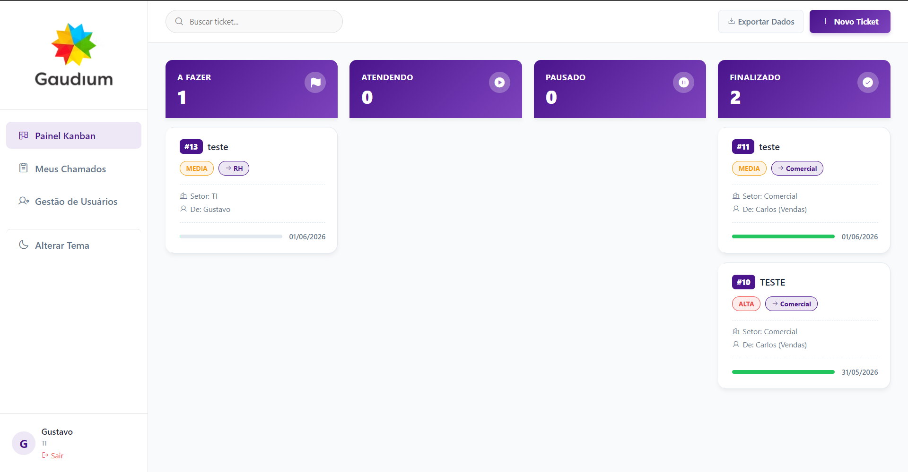
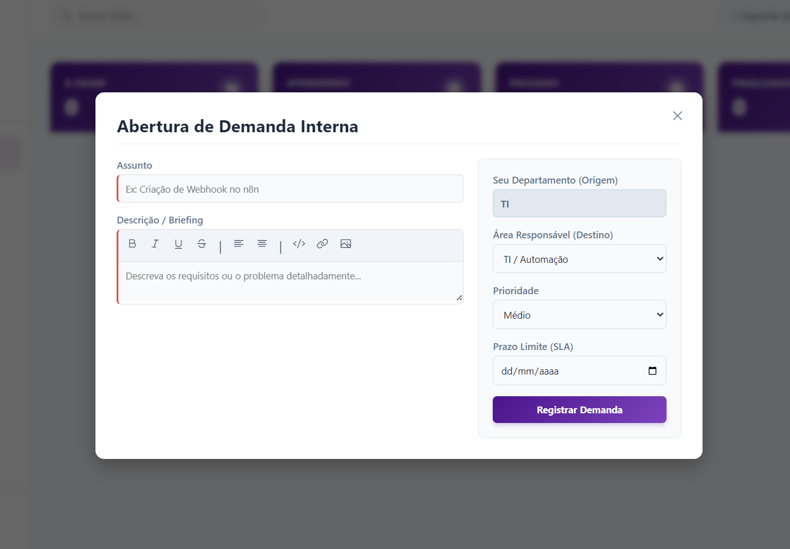
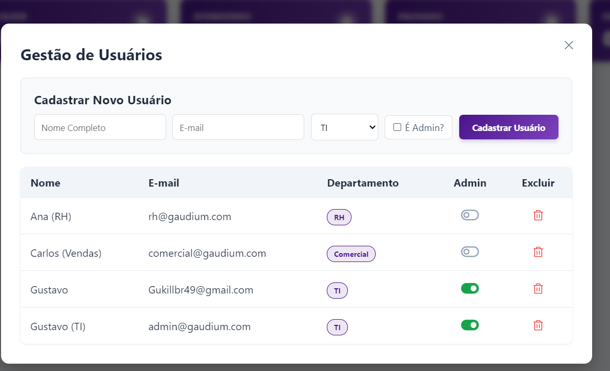
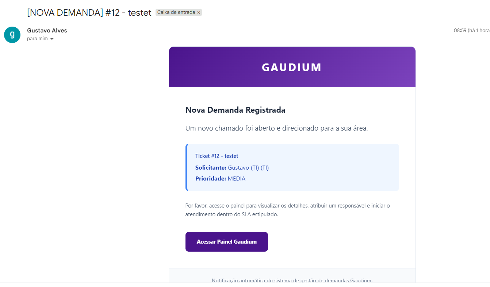
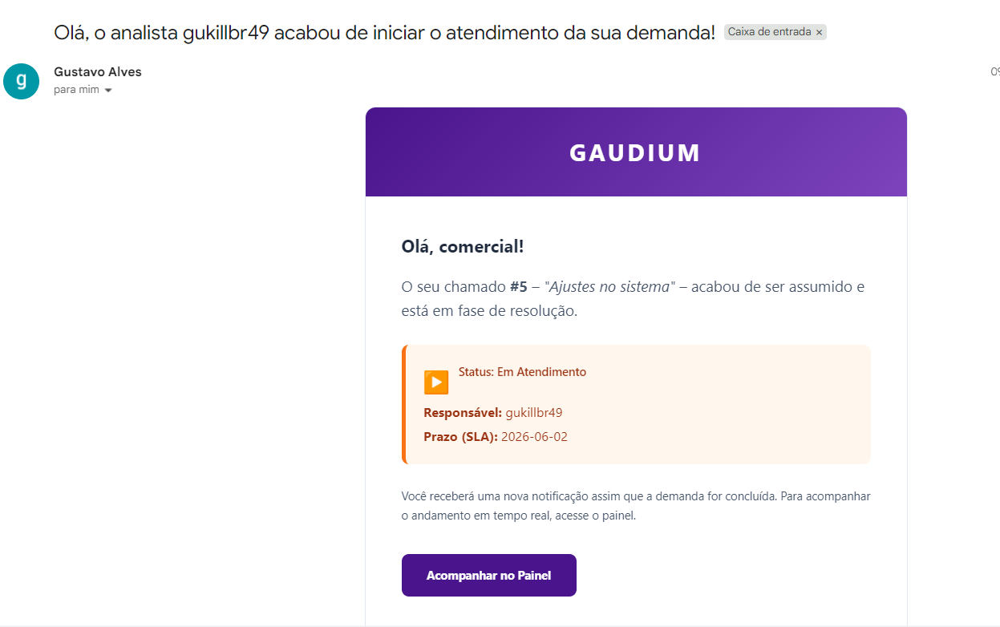
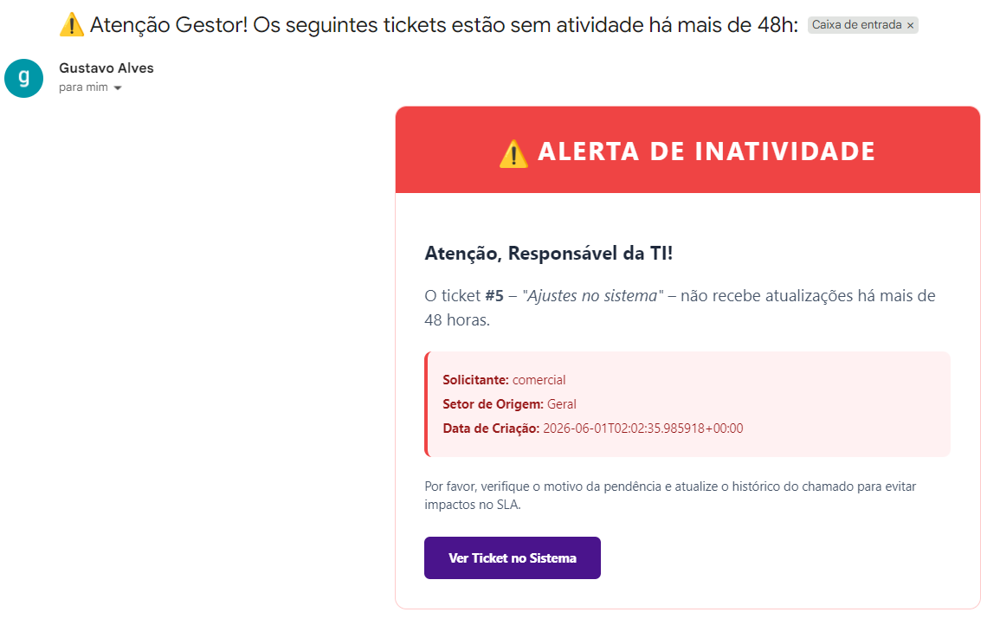

# 🚀 Gaudium - Plataforma Inteligente de Gestão de Demandas

Este projeto foi desenvolvido como solução para o **Case 3 (Plataforma de Gestão de Demandas Internas)** do desafio prático para a vaga de Estágio em Automação e Inovação MIL da Gaudium. 

A plataforma resolve o problema de solicitações internas realizadas por diferentes canais (e-mail, Discord) sem fluxo estruturado, centralizando o registro, automatizando a comunicação entre setores via **n8n** e oferecendo uma gestão visual através de um **Painel Kanban** dinâmico.

---

## 🌐 Acesso Rápido (Ambiente de Produção)

A aplicação está hospedada na nuvem e pronta para testes. Acesse através do link:
👉 **[Link do Sistema no Render]** *(Adicione seu link gerado no Render aqui)*

### Credenciais de Teste (Demo)
Para facilitar a avaliação, os seguintes utilizadores foram pré-configurados no sistema:

| Perfil | E-mail | Senha | Nível de Acesso | Visão no Kanban |
| :--- | :--- | :--- | :--- | :--- |
| **Gestor / TI** | `admin@gaudium.com` | `123456` | `is_admin = True` | Vê todas as demandas de todas as áreas. Pode criar utilizadores e excluir tickets. |
| **Colaborador** | `comercial@gaudium.com` | `123456` | `is_admin = False` | Vê apenas as demandas direcionadas ao seu próprio departamento (Comercial). |

> ⚠️ **Aviso Técnico sobre as Automações (n8n):** > Para fins de desenvolvimento e segurança das credenciais de SMTP, o motor de automação (n8n) está configurado a correr localmente na minha máquina (*localhost*). 
> * **No link do Render acima:** A banca poderá testar toda a interface, criação de tickets, movimentação no Kanban, relatórios e gestão de utilizadores perfeitamente.
> * **Os disparos de E-mail:** Como o webhook aponta para o meu ambiente local, os e-mails transacionais não serão enviados através da versão hospedada no Render. Esta integração completa será **demonstrada a funcionar em tempo real durante a minha apresentação**. (Veja as imagens reais abaixo).

---

## 📸 Demonstração Visual

### 💻 Interface do Sistema
A plataforma foi desenhada com foco na usabilidade, garantindo que qualquer colaborador consiga utilizar sem necessidade de treino prévio.

<div align="center">
  
  <p><em>Painel Kanban interativo com cálculo visual de SLA e divisão por cores.</em></p>
</div>

<br>

<div align="center">
  
  
  <p><em>Formulário de abertura de chamados (esquerda) e Gestão de Utilizadores com RBAC (direita).</em></p>
</div>

### 🤖 Automações de Notificação (n8n)
O sistema não depende de cobrança humana. Webhooks disparam gatilhos no n8n que gerem toda a comunicação transacional com os colaboradores e gestores:

<div align="center">
  
  
  
  <p><em>Fluxo dinâmico: Criação (Roxo), Atendimento Iniciado (Laranja) e Alerta de Ociosidade para Gestores (Vermelho).</em></p>
</div>

---

## 📊 Roteiro da Apresentação (O Impacto Gerado)

Este projeto foi arquitetado com foco em **eficiência operacional e ganhos mensuráveis**. Abaixo, o fluxo lógico da solução:

1. **O Problema Atual:** Demandas perdidas no Discord/WhatsApp, falta de SLA claro e o solicitante no "escuro" sem saber quem está a atender.
2. **A Solução (Portal Único):** Um ambiente de abertura estruturada de chamados. O Kanban organiza visualmente o que é prioridade.
3. **Automação Inteligente (n8n):** O Webhook avisa quando o ticket nasce, notifica o solicitante quando o analista assume a demanda, e finaliza quando concluído.
4. **Ganhos Mensuráveis (A Cereja do Bolo):** * **Visualização de SLA:** Cálculo em tempo real com barra de progresso (Risco Crítico, Atrasado, etc).
   * **Exportação de Dados:** Botão para gerar relatórios CSV num clique, entregando *Business Intelligence* imediato para a diretoria.
   * **Segurança (RBAC):** Proteção de nível empresarial com Supabase *Row Level Security*, garantindo que cada um só acesse o que lhe compete.

---

## ✨ Destaques Técnicos & Funcionalidades

* **Autenticação e Segurança (Auth):** Login, gestão de sessões criptografadas e recuperação de senhas nativa via e-mail.
* **Controlo de Acesso (RBAC):** Sistema hierárquico isolando a visão com base na variável `is_admin`.
* **Painel Kanban Interativo:** Interface moderna com recurso *Drag & Drop* para movimentação de status.
* **Exportação de Dados:** Geração instantânea de relatórios `.csv` com o inventário do ecrã atual.
* **UI/UX Premium:** Alertas customizados (`CustomUI`), responsividade e **Modo Escuro (Dark Mode)** integrado.

---

## 🛠️ Stack Tecnológica

* **Backend:** Python (Flask)
* **Banco de Dados & Auth:** Supabase (PostgreSQL)
* **Integrações & Automação:** n8n (Webhooks e Email SMTP)
* **Frontend:** HTML5, CSS3, JavaScript (Vanilla) + Phosphor Icons
* **Servidor Web (Produção):** Gunicorn
* **Hospedagem (Deploy):** Render

---

## ☁️ Instruções de Deploy (Render)

A aplicação foi preparada para subida automática via integração com o GitHub:

1. Conecte o repositório a um novo **Web Service** no Render.
2. **Build Command:** `pip install -r requirements.txt`
3. **Start Command:** `gunicorn app:app`
4. Na aba **Environment**, adicione as chaves ocultadas pelo `.gitignore`:
   * `SUPABASE_URL` = url-do-projeto
   * `SUPABASE_KEY` = chave-service-role *(Garante poder de admin para criar utilizadores no Auth)*
   * `N8N_WEBHOOK_URL` = url-do-webhook-de-producao
5. **Ajuste Final:** Atualize a `Site URL` e as `Redirect URLs` no painel do Supabase Authentication para o domínio gerado pelo Render.

---

## ⚙️ Como executar localmente (Ambiente de Desenvolvimento)

```bash
# 1. Clone o repositório
git clone [https://github.com/SEU_USUARIO/desafio-Gaudium.git](https://github.com/SEU_USUARIO/desafio-Gaudium.git)
cd desafio-Gaudium

# 2. Crie e ative o ambiente virtual
python -m venv venv
source venv/bin/activate  # (No Windows: venv\Scripts\activate)

# 3. Instale as dependências
pip install -r requirements.txt

# 4. Crie o arquivo .env e insira as suas chaves do Supabase e n8n
# (SUPABASE_URL, SUPABASE_KEY, N8N_WEBHOOK_URL)

# 5. Inicie o servidor
python app.py
